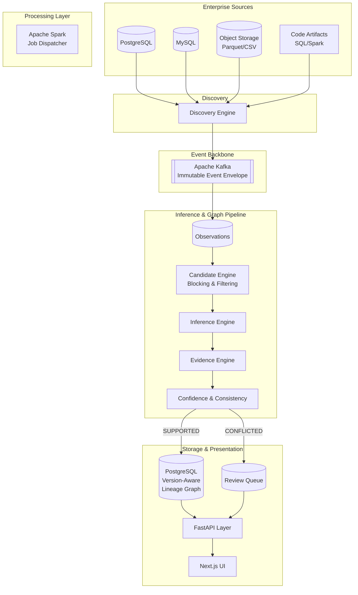

# MOSAIC Architecture

## Overall System Architecture

## Inference Pipeline Lifecycle

1. **OBSERVED:** Raw facts are extracted from data sources or artifact parsers.
2. **CANDIDATE:** Plausible relationships are identified using cheap heuristics (Blocking/Indexing).
3. **EVALUATED:** Expensive inference algorithms test the candidate.
4. **INFERRED:** The algorithm produces a hypothesis and confidence score.
5. **SUPPORTED / CONFLICTED / REJECTED:** Consistency checks apply evidence thresholds and contradiction rules. Conflicted relationships enter the Review Queue.
6. **PROMOTION POLICY (LINEAGE ASSERTION):** Supported relationships meeting strict policy thresholds are promoted to full Lineage Assertions in the graph.
7. **HUMAN REVIEW:** Engineers can CONFIRM, REJECT, or OVERRIDE inferences, generating audit events.

## Why Kafka?
MOSAIC treats discovery, profiling, artifact analysis, and inference as asynchronous event-driven operations. Kafka provides immutable event history, decoupled consumers, replayability, correlation IDs, and failure recovery.

## Why Spark?
The expensive part of reconstruction is cross-dataset statistical comparison and value analysis. Once the candidate set is generated, Spark allows those workloads to scale without forcing the entire system into Spark.
