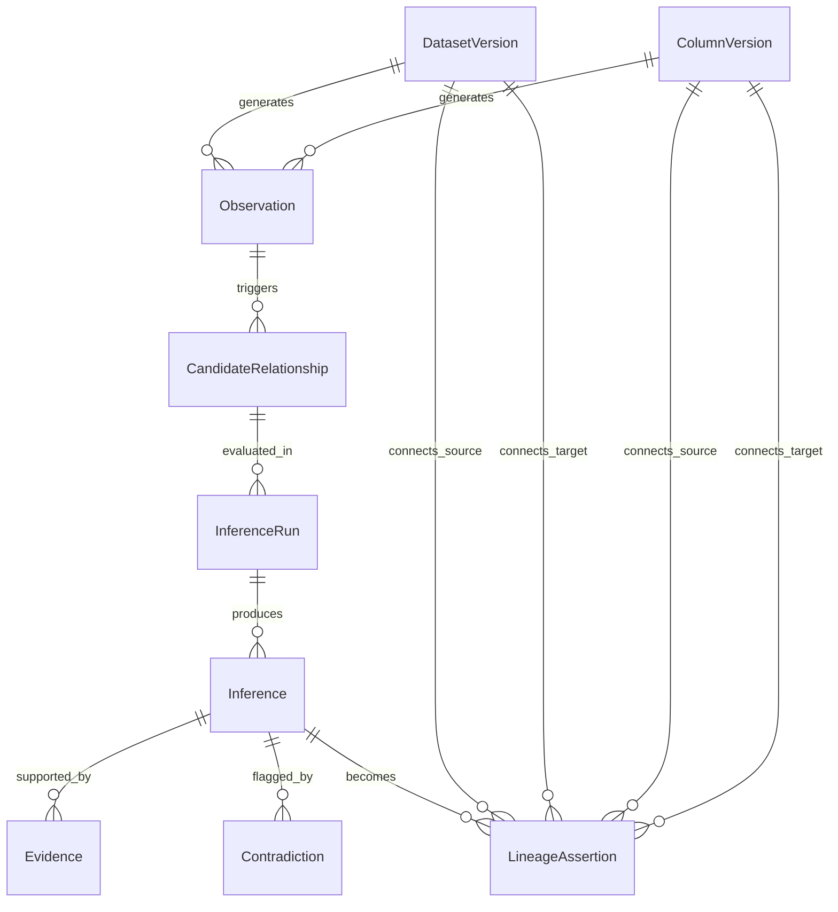

# Domain Model

## Key Entities
- **DatasetVersion / ColumnVersion:** Lineage explicitly links versions, not generic tables/columns.
- **Observation:** A hard fact extracted from an environment (e.g. "Script X selects Y").
- **CandidateRelationship:** A pair identified through cheap blocking heuristics.
- **InferenceRun:** The deterministic execution context (algorithm version, timestamp, configuration hash).
- **Inference:** The calculated hypothesis.
- **Evidence / Contradiction:** Positive and negative statistical or structural signals backing an inference.
- **LineageAssertion:** A confirmed relationship integrated into the directed lineage graph.
